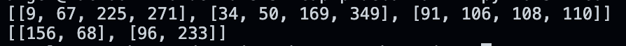

#   Image Matrix Operations

## Description
In this repository is located some python files that were created in order to understand how the pixels matrix are stored and how it can be modified by applying them some transformation operations. 

## Main Learnings 
* Read images 
* Transform the image matrix in different ways (Resize, Change color)
* Implementation of the Convulsion matrix operation

## Installation
* Make sure to have installed python and pip
* Download the repository on your local machine
* Open a terminal and locate it at the project root path 
* Run the command <code>pip install opencv-python</code>
* Now you can run both of the python files <code>ejemplo1.py</code> or <code>miconvulsion.py</code>

## Screenshots

    
